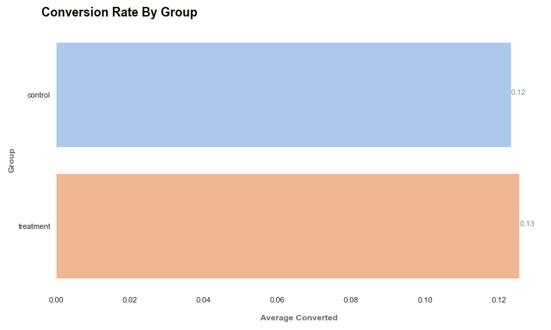

# A/B DataSet Test

     

## Scenario
The UX designer worked really hard on a new version of the product page, 
with the hope that it will lead to a higher conversion rate. The PM told you that
**_the current conversion rate is about 13%_** on average throughout the year , and that the team would
be happy with an **_increase of 2%_**, meaning that the new design will be considered a success if it raises 
the conversion rate to 15%.

Given we don't know if the new design will perform better or worse(or the same) as our current design, 

we'll choose a  **two-tailed test**:
       
                H0 : p = p0
            
                Ha : p ≠ p0

Where p and p0 stand for the conversion rate of the new and old design, respectively. We'll also set 
a **_confidence level of 95%_** :  

                α = 0.05 
    

The **α** value is a threshold we set, by which we say " If the probability of observing a result as extreme
or more (p-value) is lower than alpha , then we reject the Null hypothesis". 

Since our α = 0.05 (indicating 5% probability), our confidence (1 - α) is 95 % 

## Choosing the variables 

For our test we'll need **two groups**:

* A _control_ group - they'll be shown the old design 
* A _treatment_ group - They'll be shown the new design. 

For our Dependent Variable (i.e. what are we trying to measure), we are interested in capturing the 
conversion rate. 
A way we can code this is by each user session with a binary variable:

* _0_ - User did not buy the product during this user session 
* _1_ - User bought the product during this user session 

This way, we can easily calculate the mean for each group to get the conversion rate
of each design. 

## Choosing a sample size 

    effect_size = sms.proportion_effectsize(0.13, 0.15)
    required_n = sms.NormalIndPower().solve_power(effect_size, power=.8, alpha=.05, ratio=1)
    required_n = ceil(required_n)
    print(required_n)
    
    4720

We'd need **at least 4720 observations for each group** 4720 X 2 

Having set the _power_ to 0.8 means if there exists an actual difference in conversion rate
between our designs, we have about 80 % chance to detect it as statistically significant
in our test with the sample size we calculated. 

## Collecting and preparing the Data 
            user_id          timestamp             group    landing_page   converted
        0   851104  2017-01-21 22:11:48.556739    control     old_page          0
        1   804228  2017-01-12 08:01:45.159739    control     old_page          0
        2   661590  2017-01-11 16:55:06.154213  treatment     new_page          0
        3   853541  2017-01-08 18:28:03.143765  treatment     new_page          0
        4   864975  2017-01-21 01:52:26.210827    control     old_page          1

To make sure all the control group are seeing the old page and vice versa

crosstab_data = pd.crosstab(ab_testing["group"], ab_testing["landing_page"])
print(crosstab_data)

        landing_page  new_page  old_page
        group                           
        control           1928    145274
        treatment       145311      1965

Before we go ahead and sample the data to get our subset, let's make sure there are no users that 
have been sampled multiple times.

session_count = ab_testing["user_id"].value_counts(ascending=False)
print(session_count)

    user_id
    805339    2
    754884    2
    722274    2
    783176    2
    898232    2
             ..
    642985    1
    771499    1
    923606    1
    712675    1
    715931    1
    Name: count, Length: 290584, dtype: int64

multi_users = session_count[session_count > 1].count()

    There are **3894** users that appear multiple times in the dataset. 

We'll go ahead and remove them from the DataFrame to avoid sampling the same users twice.

    users_to_drop = session_count[session_count > 1].index
    
    ab_testing = ab_testing[~ab_testing["user_id"].isin(users_to_drop)] 
    
    The update dataset now has 286690 entries.

## Sampling 

control_sample = ab_testing[ab_testing["group"] == "control"].sample(n=required_n, random_state=22)
treatment_sample = ab_testing[ab_testing["group"] == "treatment"].sample(n=required_n, random_state=22)
print(ab_test["group"].value_counts())

        group
        control      4720
        treatment    4720
        Name: count, dtype: int64

## Visualising the result 

                    conversion_rate  std_deviation  std_error
        group                                               
        control              0.123          0.329      0.005
        treatment            0.126          0.331      0.005

It does look like our two designs performed very similarly, with our new design performing slightly
better, **approx. 12.3% vs. 12.6 % conversion rate**

## Testing the hypothesis 
    z statistic : -0.34
    p-value: 0.732
    ci 95% for control group: [0.114, 0.133]
    ci 95% for treatment group: [0.116, 0.135]

## Drawing conclusions 
Since our **p-value = 0.732 is way above our α = 0.05 threshold**, we cannot reject 
the Null hypothesis H0, which means that **our new design did not perform significantly different(let alone better)
than our old one :(** 

Additionally, if we look at the confidence interval for the treatment group [11.6 - 13.5%]
we notice that :

* It includes our baseline value of 13% conversion rate 
* It does not include our target value 15% (the 2 % uplift we were aiming for)

What this means is that it is more likely that the true conversion rate of the new 
design is similar to our baseline, rather than the 15% target we had hope for.
This is further proof that our new design is not likely to be an improvement on our old
design, and that unfortunately we are back to the drawing board! 